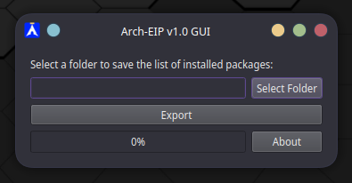
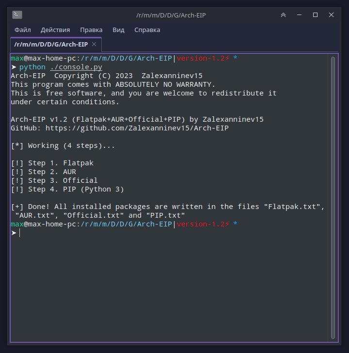

# Arch-EIP


 [](https://github.com/Zalexanninev15/Arch-EIP) 
 [](https://github.com/Zalexanninev15/Arch-EIP) 
 [](https://github.com/Zalexanninev15/Arch-EIP) 
 [](https://github.com/Zalexanninev15/Arch-EIP/commits/master) 
 [](LICENSE) 
 [](https://zalexanninev15.jimdofree.com/buy-me-a-coffee) 

## Screenshots

#### GUI implementation



#### Console implementation



## Description

Script for exporting installed packages to list in Arch linux for Flatpack, AUR, Official and PIP (Python 3). Example [here](https://cloud.disroot.org/s/4K63rWKJZ9YDxcP) (from [my Telegram channel PingvinusFun](https://ttttt.me/pingvinusfun) (RU), where I talk about my adventures and discoveries in OpenSource and Linux, which I became actively interested in 2023, [post with example](https://ttttt.me/pingvinusfun/34)). To get packages, I use `flatpak`, `pamac` and `grep` to exclude unnecessary strings. All tests were performed on Manjaro Linux ([example](https://ttttt.me/Zalexanninev15_News/825))

## Usage

#### GUI implementation

Prepare for GUI version launch:

```bash
pip install PySide6
chmod +x ./gui.py
```

Just run the `gui.py` file, just run it with a mouse click and choose what to export (***Flatpak***/***AUR***/***Official***/***PIP***). Click "Export" and wait for the result.

> In general, I'm new to all these GUI on Linux (this is my first graphical application), previously I did only on WinForms and a little WPF on Windows, so do not hesitate and correct my code/pay my attention to errors

#### Console implementation

Do the following in terminal or just launch with a mouse click (or how many of them you need to produce 😉)

```bash
python ./console.py
```

The packages of each type of package will be written to the appropriate text file: `Flatpak.txt`, `AUR.txt`, `Official.txt` and `PIP.txt`

## Licensing

| Project                                      | License          |
| -------------------------------------------- | ---------------- |
| [PySide6](https://pypi.org/project/PySide6/) | LGPL-3.0/GPL-2.0 |